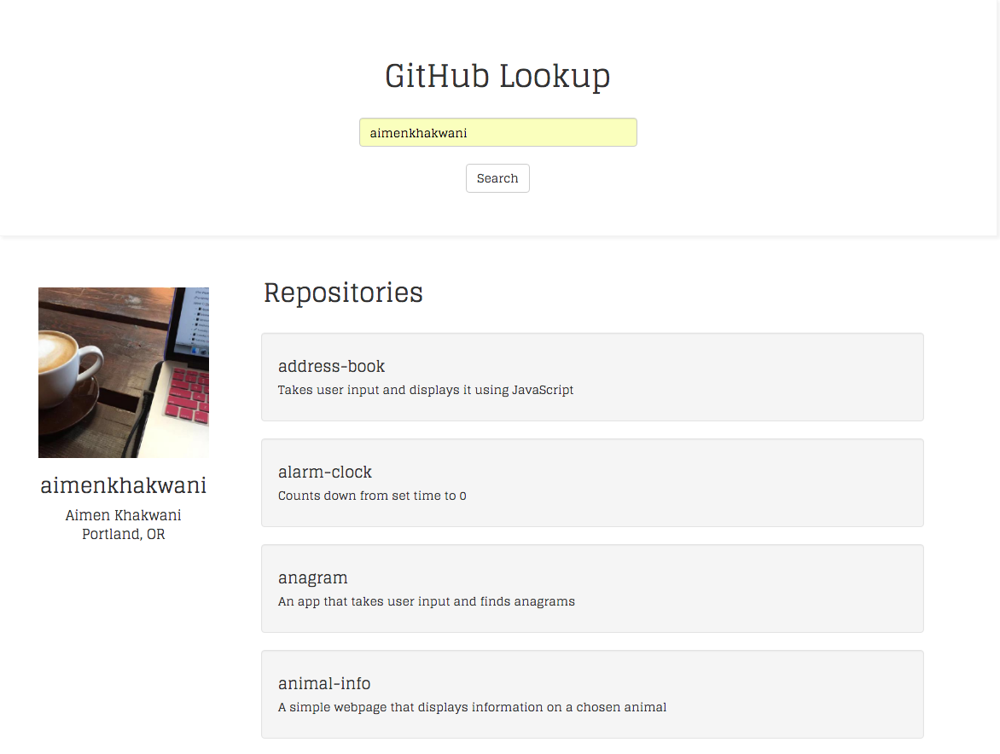

# GitHub User Lookup

#### _10-14-16_

#### By _**Aimen Khakwani**_

## Description

This web app uses the GitHub API to allow users to search Github by username. It then shows the image, name, location, and repositories for that account.

## Setup/Installation Requirements

* Clone the repository
* Using the command line, navigate to the project's root directory
* Take '.env' out of the .gitignore file
* Add (exports.apiKey = "";) to the .env file without parens, and add an api key in the double quotes
* Install node dependencies by running $ npm install
* Install bower dependencies by running $ bower install
* Build the files by running $ gulp build
* Open index.html to view application in browser

## Known Bugs

_None_

## Technologies Used

_HTML,
CSS,
JavaScript,
Node,
Bootstrap
jQuery_

### License

*This webpage is licensed under the MIT license.*

Copyright (c) 2016 **_Aimen Khakwani_**
